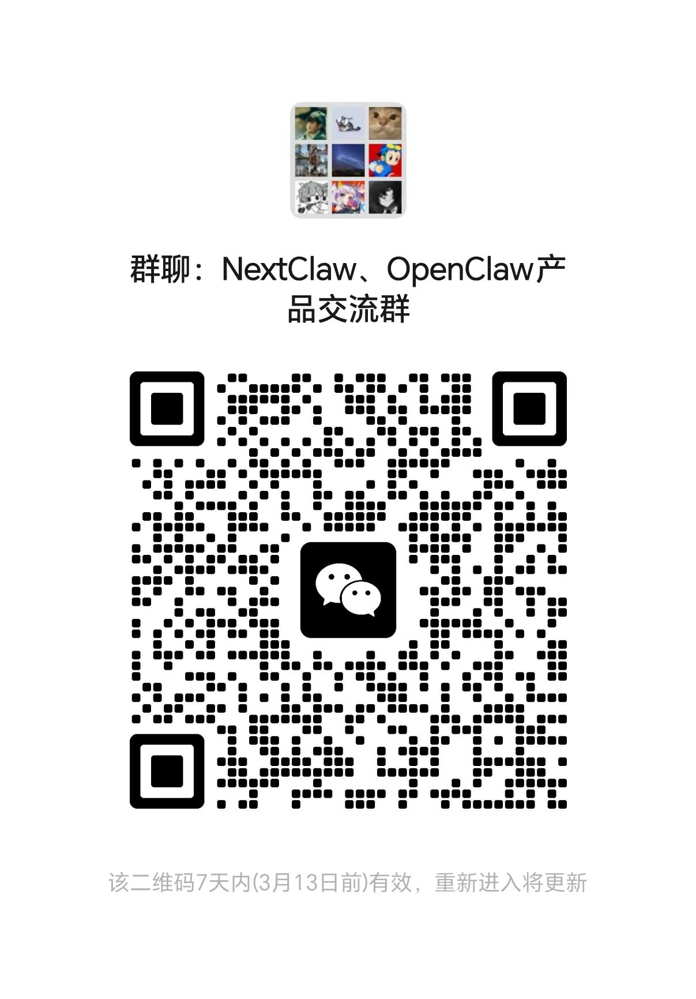

<p align="right">
  <a href="./README.zh-CN.md">简体中文</a>
</p>

<div align="center">


<br /><br />

# NextClaw

**Your omnipotent personal AI assistant. One command. Runs locally.**

[](https://www.npmjs.com/package/nextclaw)
[](LICENSE)
[](https://nodejs.org)
[](https://discord.gg/j4Skbgye)

[Documentation](https://docs.nextclaw.io/en/) · [Discord](https://discord.gg/j4Skbgye) · [Issues](https://github.com/Peiiii/nextclaw/issues) · [Roadmap](https://docs.nextclaw.io/en/guide/roadmap)

<p>
  
  
  
  
  
</p>

</div>

---

NextClaw orchestrates the entire internet and raw compute from your machine — bending every bit and byte to manifest your intent into reality. Inspired by [OpenClaw](https://github.com/openclaw/openclaw) and fully compatible with its plugin ecosystem.

- **One-command startup** — `nextclaw start`, then configure everything in the browser UI
- **12+ AI providers** — OpenRouter, OpenAI, Anthropic, Gemini, DeepSeek, Groq, MiniMax, and more
  <br />           
- **10+ message channels** — Discord, Telegram, Slack, WhatsApp, Feishu, DingTalk, WeCom, QQ, Email
  <br />         
- **Built-in automation** — Cron & Heartbeat for scheduled autonomous tasks
- **Local & private** — Runs entirely on your machine; configs, history, and tokens stay with you
- **Ultra-lightweight** — ~1/20 the codebase of OpenClaw, easier to maintain and extend

## Quick Start

### 0. Prerequisites

- Install Node.js (LTS recommended): [nodejs.org](https://nodejs.org/)
- Open a terminal:
  - Windows: `Win + R`, type `cmd` (or open PowerShell)
  - macOS: `Command + Space`, search `Terminal`
  - Linux: `Ctrl + Alt + T` (or Terminal from app menu)

Verify your environment first:

```bash
node -v
npm -v
```

```bash
npm i -g nextclaw
nextclaw start
```

Open **http://127.0.0.1:18791** → set your provider and model → start chatting.

```bash
nextclaw stop    # stop the service
```

If `npm` is not found, install/reinstall Node.js and reopen your terminal.

> Full configuration guide: [docs.nextclaw.io](https://docs.nextclaw.io/en/guide/configuration)
>
> Beginner step-by-step guide (with troubleshooting): [Getting Started](https://docs.nextclaw.io/en/guide/getting-started)

## Screenshots

Refresh all product screenshots (website + GitHub assets):

```bash
pnpm screenshots:refresh
```

**Agent Chat** — send tasks and review multi-turn conversations in one place:


**AI Providers** — configure and switch between providers in the UI:


**Message Channels** — enable Discord, Telegram, Feishu, QQ, and more:


## Documentation

Visit **[docs.nextclaw.io](https://docs.nextclaw.io/en/)** for the full documentation, including:

- [Model Selection](https://docs.nextclaw.io/en/guide/model-selection)
- [Commands](https://docs.nextclaw.io/en/guide/commands)
- [Vision & Roadmap](https://docs.nextclaw.io/en/guide/vision)
- [Feishu Setup Tutorial](https://docs.nextclaw.io/en/guide/tutorials/feishu)

## Community

- **Discord** — [NextClaw / OpenClaw](https://discord.gg/j4Skbgye)
- **WeChat Group** — Scan to join:

  

## Contributing

Contributions are welcome! Please open an issue or submit a pull request.

## Acknowledgements

NextClaw is inspired by and built upon the shoulders of these great projects:

- [OpenClaw](https://github.com/openclaw/openclaw) — The full-stack AI assistant platform that inspired NextClaw's architecture and plugin ecosystem.
- [NanoBot](https://github.com/nicepkg/gpt-runner) — A lightweight Python agent framework that demonstrated how simplicity and power can coexist.

## License

[MIT](LICENSE)

---

<div align="center">

[](https://star-history.com/#Peiiii/nextclaw&Date)

</div>
