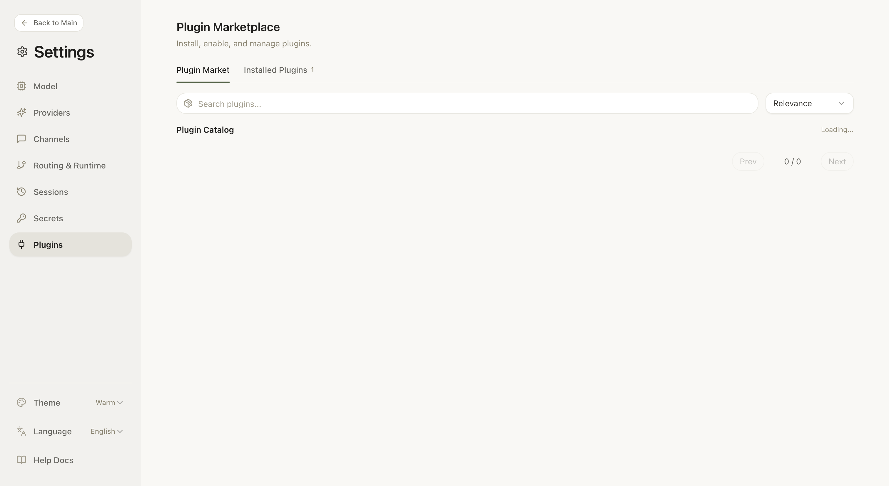
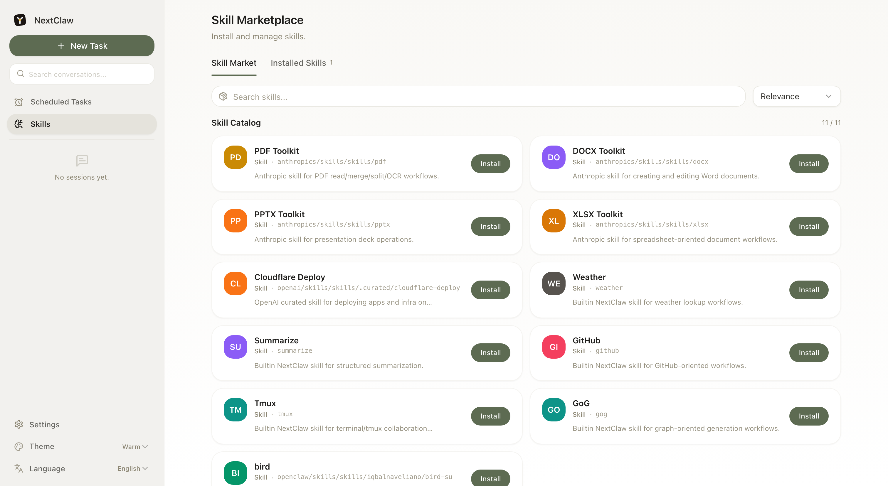

<div align="center">

# NextClaw

**Your omnipotent personal assistant**

[](https://www.npmjs.com/package/nextclaw)
[](https://nodejs.org)
[](LICENSE)
[](https://docs.nextclaw.io/en/)
[](https://docs.nextclaw.io/en/)
[](https://docs.nextclaw.io/en/)

[English](README.md) | [简体中文](README.zh-CN.md)

[Why NextClaw?](#why-nextclaw) · [Quick Start](#-quick-start) · [Features](#-features) · [Screenshots](#-screenshots) · [Commands](#-commands) · [Channels](#-channels) · [Docs](https://docs.nextclaw.io/en/)

</div>

---

Inspired by [OpenClaw](https://github.com/openclaw/openclaw) & [nanobot](https://github.com/HKUDS/nanobot), **NextClaw** is your omnipotent personal assistant: it orchestrates internet resources and raw compute from your own machine while staying OpenClaw-compatible. Install once, run `nextclaw start`, then configure providers and channels in the browser. No onboarding wizard, no daemon setup — just one command and you're in.

**Best for:** quick trials, secondary machines, or anyone who wants multi-channel + multi-provider with low maintenance overhead.

### Why NextClaw?

| Advantage | Description |
|-----------|-------------|
| **Feature-rich** | Multi-provider, multi-channel, cron/heartbeat, web search, exec, memory, subagents — same capabilities as OpenClaw where it matters. |
| **OpenClaw compatible** | Uses OpenClaw plugin SDK and channel plugin format; built-in channel plugins (Telegram, Discord, WhatsApp, etc.) are OpenClaw-style and configurable the same way. |
| **Easier to use** | No complex CLI workflows — one command (`nextclaw start`), then configure and chat in the built-in UI. |
| **Maintainable by design** | Keep runtime capabilities focused on built-ins, reducing hidden coupling and long-term maintenance cost. |
| **Ultra-lightweight** | Evolved from [nanobot](https://github.com/HKUDS/nanobot); minimal codebase, fast to run and maintain. |

---

## ✨ Features

| Feature | Description |
|---------|-------------|
| **OpenClaw compatible** | Same plugin SDK and channel plugin format; use OpenClaw-style plugins and config. |
| **One-command start** | `nextclaw start` — background gateway + config UI, no extra steps |
| **Built-in chat + config UI** | Chat with agent (Markdown rendering, tool trace cards, grouped messages), then tune models/providers/channels in one place; config in `~/.nextclaw/config.json` |
| **Secrets support** | OpenClaw-style secret refs (`env` / `file` / `exec`) via `secrets.refs`, without storing plaintext keys in config |
| **Multi-provider** | OpenRouter, OpenAI, MiniMax, Moonshot, Gemini, DeepSeek, DashScope, Zhipu, Groq, vLLM, and more (OpenAI-compatible) |
| **Multi-channel** | Telegram, Discord, WhatsApp, Feishu, DingTalk, WeCom, Slack, Email, QQ, Mochat — enable and configure from the UI |
| **Automation** | Cron + Heartbeat for scheduled tasks |
| **Local tools** | Web search, command execution, memory, subagents |

---

## 🚀 Quick Start

```bash
npm i -g nextclaw
nextclaw start
```

Open **http://127.0.0.1:18791** → set your provider (e.g. OpenRouter) and model, then go to **Chat** tab to talk with your agent.

NextClaw now binds UI on `0.0.0.0` by default for `start/restart/serve/ui/gateway` UI mode; startup logs print detected public URLs.

```bash
nextclaw stop   # stop the service
```

---

## 📸 Screenshots

**Config UI** — providers, models, and defaults in one screen:


**AI Providers** — configure OpenRouter, OpenAI, MiniMax, DashScope, and more; view configured vs all providers:


**Message Channels** — enable and configure Discord, Feishu, QQ, and more:


**Cron Jobs** — view and manage scheduled tasks, run now, enable/disable, track last run:


**Plugins** — install and manage channel and provider plugins from the catalog:



**Skills** — enable and configure skills (web search, exec, memory, subagents, etc.):



---

## 🔌 Provider examples

<details>
<summary>OpenRouter (recommended)</summary>

```json
{
  "providers": { "openrouter": { "apiKey": "sk-or-v1-xxx" } },
  "agents": { "defaults": { "model": "minimax/MiniMax-M2.5" } }
}
```

</details>

<details>
<summary>MiniMax (Mainland China)</summary>

```json
{
  "providers": {
    "minimax": { "apiKey": "sk-api-xxx", "apiBase": "https://api.minimaxi.com/v1" }
  },
  "agents": { "defaults": { "model": "minimax/MiniMax-M2.5" } }
}
```

</details>

<details>
<summary>Local vLLM</summary>

```json
{
  "providers": {
    "vllm": { "apiKey": "dummy", "apiBase": "http://localhost:8000/v1" }
  },
  "agents": { "defaults": { "model": "meta-llama/Llama-3.1-8B-Instruct" } }
}
```

</details>

---

## 📋 Commands

| Command | Description |
|---------|-------------|
| `nextclaw start` | Start background service (gateway + UI, public by default) |
| `nextclaw restart` | Restart background service without manual stop/start |
| `nextclaw stop` | Stop background service |
| `nextclaw ui` | Start UI backend + gateway (foreground) |
| `nextclaw gateway` | Start gateway only (for channels) |
| `nextclaw agent -m "hello"` | Chat in CLI |
| `nextclaw status` | Show runtime process/health/config status (`--json`, `--verbose`, `--fix`) |
| `nextclaw update` | Self-update the CLI |
| `nextclaw channels status` | Show enabled channels |
| `nextclaw doctor` | Run runtime diagnostics (health, state coherence, port checks) |
| `nextclaw channels login` | QR login for supported channels |
| `nextclaw config get <path>` | Get config value by path (`--json` for structured output) |
| `nextclaw config set <path> <value>` | Set config value by path (`--json` to parse value as JSON) |
| `nextclaw config unset <path>` | Remove config value by path |

---

## 💬 Channels

| Channel | Setup |
|---------|-------|
| Telegram | Easy (bot token) |
| Discord | Easy (bot token + intents) |
| WhatsApp | Medium (QR login) |
| Feishu | Medium (app credentials) |
| Mochat | Medium (claw token + websocket) |
| DingTalk | Medium (app credentials) |
| WeCom | Medium (corp app + callback endpoint) |
| Slack | Medium (bot + app tokens) |
| Email | Medium (IMAP/SMTP) |
| QQ | Easy (app credentials) |

---

## 📚 Docs

- [Roadmap](https://docs.nextclaw.io/en/guide/roadmap)
- [Configuration, providers, channels, cron](https://docs.nextclaw.io/en/guide/configuration)
- [Multi-agent architecture: single Gateway, bindings, session isolation](https://docs.nextclaw.io/en/guide/multi-agent)
- [RFC: Action Schema v1](https://docs.nextclaw.io/en/)
- [Code volume monitoring workflow](https://docs.nextclaw.io/en/)
- [Marketplace Worker deploy workflow](https://docs.nextclaw.io/en/)
- [Marketplace read-only Worker API](https://github.com/Peiiii/nextclaw/blob/master/workers/marketplace-api/README.md)

---

<div align="center">

[](https://star-history.com/#Peiiii/nextclaw&Date)

**License** [MIT](LICENSE)

</div>
